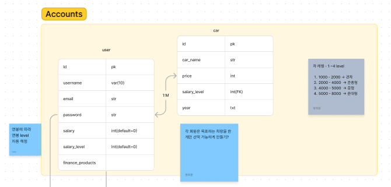
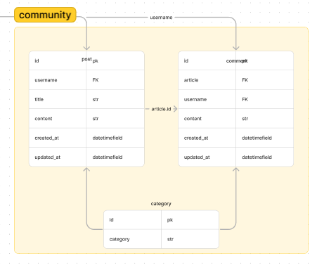
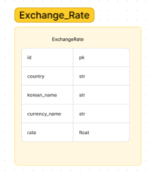
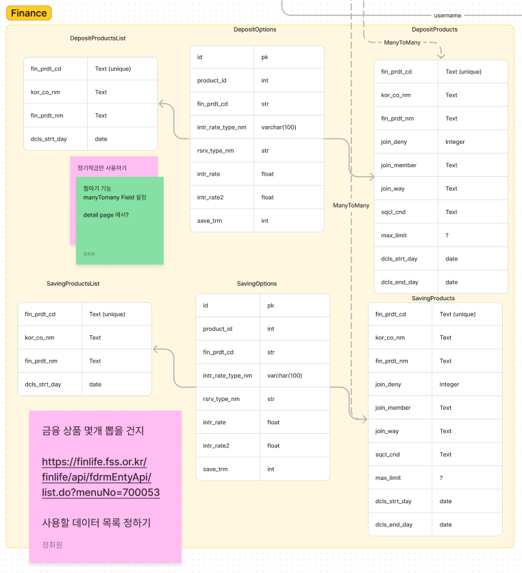
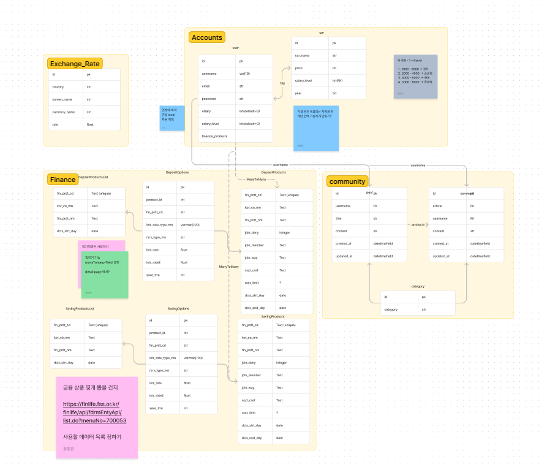
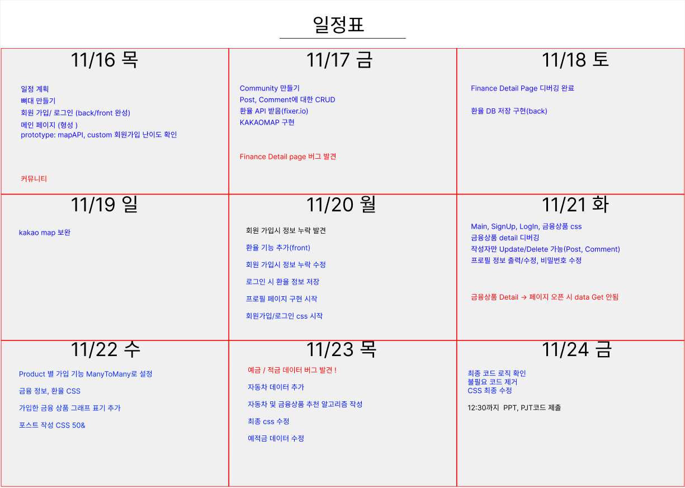
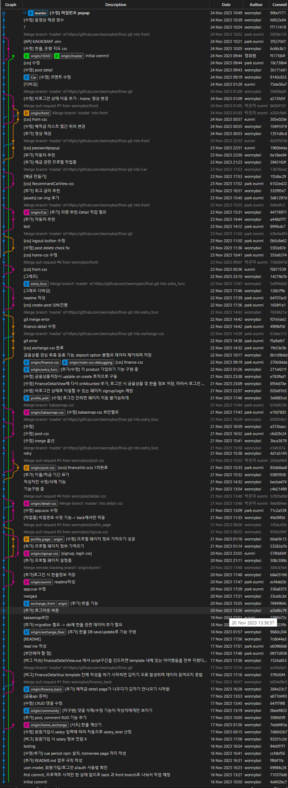

# Last_project

## 일정표

|날짜|목표|중요도|예상 난이도|
|:---|---------:|:---:|:---:|
|11/16 (목)|일정 계획, skeleton code만들기, |★★|  |
||signup, login (front, back), mainpage|★★★|  |
|11/17 (금)|post RUD, comment CRUD |★★★|★★★|
|| FinanaceDetail page, KakaoMap page|★★★★|★★★★★|
|11/18 (토)|환율 API KakaoMap page 보안|★★★★|★★★★★|
|11/19 (일)| KakaoMap page 보안|★★★|★★★|
|11/20 (월)|환율 계산기, logout 버튼, app.singup.login css|★★★|★★|
|11/21 (화)|profile page, css|★★★|★★★|
|11/21 (수)|예적금 금리 비교, css|★★★|★★★|
|11/21 (목)|README 작성, 금융 상품 추천 알고리즘, PPT|★★★★|★★★★|

### 프로젝트 소개 🚗💨

우리의 프로젝트는 주로 '예비 자동차 오너'를 대상으로 하는 서비스입니다. 사용자가 회원가입할 때, 본인의 연봉을 함께 기입하면, 해당 연봉에 맞게 어울리는 차량을 추천해주는 기능을 제공합니다. 이 서비스는 연봉에 따라 다양한 차량을 고려하여 맞춤형 추천을 제공하여 자동차 구매 결정을 도울 것입니다.

뿐만 아니라, 우리는 연봉에 맞게 자동차 구매 자금을 마련하는 데 도움이 되는 예적금 상품도 함께 추천합니다. 이를 통해 사용자들은 자신의 경제적 상황에 맞춰 적절한 자동차를 선택하고 구매할 수 있을 뿐만 아니라, 구매를 위한 자금을 효율적으로 계획할 수 있습니다.

우리의 목표는 사용자들에게 보다 편리하고 맞춤형으로 자동차를 추천하며, 동시에 미래의 자동차 구매에 대비한 자금 계획을 지원하는 것입니다.

### before work 

git branch '(back/front)_기능' 으로 branch 생성

- 새로 나온 branch 에서 commit 이 밀렸을 때
1. branch --set-upstream-to=origin/master '위에 설정한 이름'
2. git pull 

-> master 브랜치와 같은 상태에 놓임.

- 새로운 branch 에서 push 

1. git push --set-upstream origin '새로운 branch 이름'
2. git switch master
3. git merge '새로운 branch 이름'
4. git push

-> master 브랜치와 같은 상태에 놓임.

- commit -m '한글로 작성, 말머리 [수정/추가...] 등 적절하게 사용 이후, 간략하게 설명'

## 버그 이슈
- 회원가입 시 salary 정보 전달 x
- FinanceDetailVue template 칸에 작성을 하기 시작하면 갑자기 오류 발생하며 데이터 읽어오지 못함

## 프로젝트 구조 _ ERD
- accounts

    

- community

    

- exchange_Rate

    

- finance

    

- ERD

    

## 프로젝트 중 일정 기록
2023/11/16
------------------

보안해야 할 점 :
1. 찾는 지역에 해당 은행이 없을 경우에 '해당 은행이 없습니다' 메세지 출력 _ KakaoMap.vue
2. CSS

할 일 :
1. 게시글/댓글 작성자만 수정, 삭제 기능 추가 DetailView.vue 
2. 환율 api 기능 추가

2023/11/20
------------------
npm install bootstrap bootstrap-vue-3
npm install -D sass

할 일
1. app.vue main3.png 구성
2. sign-up, longin css
3. a태그 링크 연결 (app.vue)
4. 프로필 페이지 구현

- 문의사항 :

1. auth.js 내에 로그인 시 환율정보를 받아오는 함수를 작성했을 때, 정상동작하지만 콘솔창에 'is not a function'이 뜸.

2023/11/21
------------------
할 일

1. app.vue main3.png 디버깅
2. finance_detail, kakaomap css
3. 예적금 금리비교

추가 구현
1. 자동차 데이터 DB
2. 프로필(+추천알고리즘), 환율, 게시글 css + 보안
3. figma 정리
4. 발표 ppt
5. readme 작성

2023/11/22
------------------
할 일

1. createPostView 50%
2. detailView, profile css
3. home content 추가 작성 
1. 그래프 작성
2. 추천 알고리즘

2023/11/23
------------------
할 일

front디버깅, readme 작성
back 디버깅, 동영상 삽입
------------------

- Calendar

    
    
- Commit Log

    
